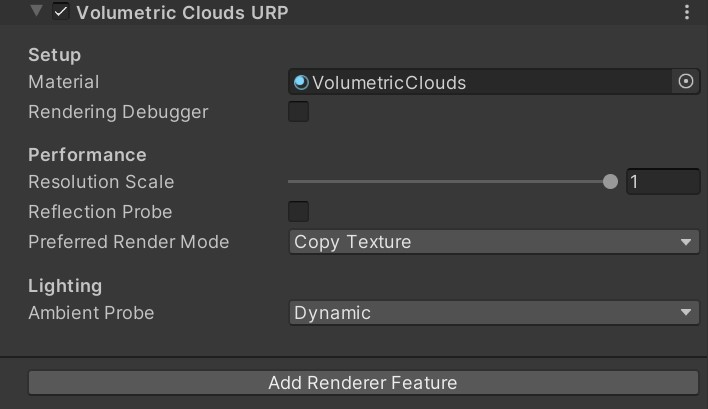
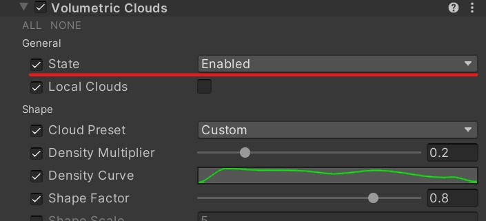
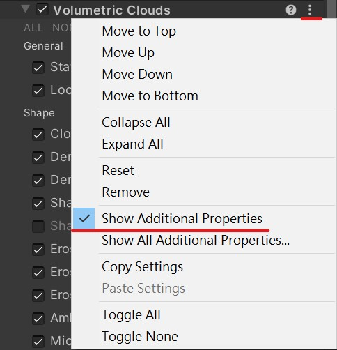

Documentation
=============

Setup
-------------

- Add **Volumetric Clouds URP** Renderer Feature to the active URP Renderer asset.

 

- Add **Sky/Volumetric Clouds (URP)** to the scene's URP Volume.

- Set the **State** to **Enabled** in Volumetric Clouds overrides.

 

- Click **Show Additional Properties** to show hidden settings.

 

- Adjust the settings in URP Volume and use different Volume types (global and local) to control volumetric clouds if needed.

- On platforms that don't implement reversed-z (ex. OpenGL), please keep the camera near plane (ex. 0.1) high to avoid depth precision issues.

Single Cloud Mode
-----------------

The volume override exposes a **Custom Cloud Texture** field for rendering a single high-detail cloud.
Import a `Texture3D` asset into the project and assign it to this field.
When a texture is provided, use **Custom Cloud Center** and **Custom Cloud Size** to position the cloud in world space.
Enable **Use Custom Cloud Texture** to activate the feature.
